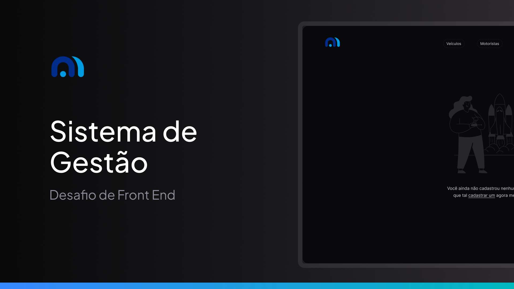

# Desafio Frontend: Cadastro e Monitoramento de Veículos em Rota



Estilo visual feita no Figma, caso queira se inspirar, acesse o meu [Projeto no Figma](https://www.figma.com/design/ZkPu3609vxUAH92mJZZm0r/Desafio-Front-End---Motora-AI-(Copy)-(Copy)?node-id=82-2&t=0VGMHdReb4iPBti5-1).

Este repositório contém a implementação de um desafio técnico voltado para o desenvolvimento de uma aplicação frontend de cadastro e monitoramento de veículos, motoristas e viagens.

## Objetivo do Desafio

Criar uma interface web que consuma a aplicação backend disponibilizada em [processo-seletivo-trainee](https://github.com/motora-ai/processo-seletivo-trainee) e atenda aos seguintes requisitos:

1. **Apresentar Dados:** Mostrar as informações de veículos, motoristas e viagens de forma organizada e intuitiva.
2. **Cadastrar:** Permitir o cadastro de novos veículos, motoristas e viagens.
3. **Modificar:** Possibilitar a edição dos dados existentes.
4. **Excluir:** Oferecer a opção de excluir veículos, motoristas e viagens.

## Tecnologias Utilizadas

A escolha das tecnologias para este projeto foi realizada de forma a maximizar a produtividade e proporcionar uma experiência de usuário moderna e responsiva. As tecnologias e ferramentas utilizadas incluem:

- **Framework Frontend:** React
- **Biblioteca de Estilo:** Tailwind CSS
- **Gerenciamento de Estado:** Redux (ou Context API, conforme necessidade)
- **Conexão em Tempo Real:** WebSocket para atualização dinâmica dos dados
- **Outros:** Axios para requisições HTTP

## Diferenciais Implementados

- Utilização de **guidelines visuais modernas** com Tailwind CSS.
- Conexão com **WebSocket** para atualização em tempo real dos dados de veículos, motoristas e viagens.
- Interface responsiva, compatível com dispositivos desktop e móveis.

## Como Executar o Projeto

### Requisitos
- Node.js
- Yarn ou npm

### Instalação
1. Clone este repositório:
   ```bash
   git clone https://github.com/tonyzinh/desafio-front.git
   ```
2. Navegue até o diretório do projeto:
   ```bash
   cd desafio-front
   ```
3. Instale as dependências:
   ```bash
   npm install
   # ou
   yarn install
   ```

### Execução
1. Inicie o servidor backend conforme instruções no [repositório backend](https://github.com/motora-ai/processo-seletivo-trainee).
2. Inicie o projeto frontend:
   ```bash
   npm start
   # ou
   yarn start
   ```
3. Acesse a aplicação em seu navegador pelo endereço:
   ```
   http://localhost:3000
   ```

## Funcionalidades

- **Listagem de Veículos, Motoristas e Viagens:** Visualização intuitiva e organizada de todas as informações cadastradas.
- **Cadastro:** Formulários simples e eficientes para adicionar novos registros.
- **Edição:** Possibilidade de alterar informações existentes com validação de dados.
- **Exclusão:** Função de remoção com confirmação para evitar exclusões acidentais.
- **Atualização em Tempo Real:** Dados atualizados automaticamente utilizando WebSocket.
---

## 🤝 Developers

We thank the following people who contributed to this project:

<table>
  <tr>
    <td align="center">
      <a href="#" title="Entony Jovino">
        <br>
        <sub>
          <b>Entony Jovino</b>
        </sub>
      </a>
    </td>
  </tr>
</table>
